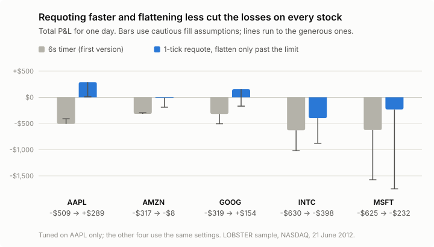
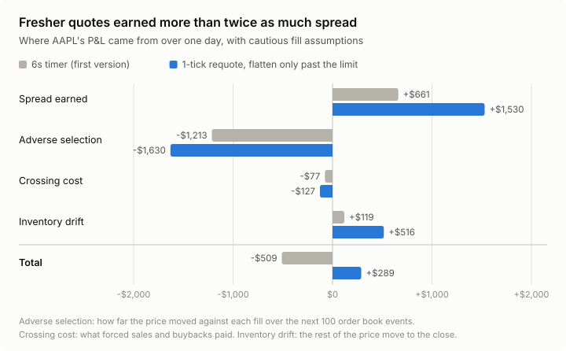

# Does Avellaneda–Stoikov work on a real order book?

I implemented the model as a market maker and replayed a day of NASDAQ order-book events. The first version lost money across all five equities I tested.

I then worked backwards from the losses. Two changes made most of the difference: requoting whenever the price moved a tick, and only flattening inventory once it breached the hard limit. Together, they cut the combined loss from $2,400 to $195.

<picture>
  <source media="(prefers-color-scheme: dark)" srcset="docs/figures/pnl-by-stock-dark.svg">
  
</picture>

## Overview

- Built a backtester that replays every order book event from LOBSTER's free NASDAQ sample (AAPL, AMZN, GOOG, INTC and MSFT on 21 June 2012).
- Modelled where my orders would sit in each price level's queue, since that decides whether they fill.
- Built the strategy from small parts (inventory skew, size skew, an order flow signal) that can each be switched on or off to see what it's worth.
- Split P&L into four sources that add up exactly to the total, so every change can be traced to where the money moved.

## How it works

A market maker posts a price to buy (the bid) and a price to sell (the ask) at the same time. When both fill, it earns the gap between them: the spread. The risk is adverse selection. Your quotes tend to get filled just before the price moves against you, because whoever trades with you often knows something you don't.

The quotes follow the Avellaneda-Stoikov model. They sit either side of the micro-price (the mid, weighted towards the side with less size waiting), at a distance set by risk aversion and how often orders arrive. They also lean to sell when I'm holding stock and to buy when I'm short. If inventory still passes half the limit, the first version crosses the spread to get rid of it, which I call a forced flatten.

My orders were never really in the book, so the simulator has to guess some things. For example, when someone cancels an order at my price, were they ahead of me in the queue or behind? The data can't settle that, so every result is run twice: with cautious and with generous fill assumptions.

I tuned everything on AAPL, then ran the same settings on the other four. For each experiment I wrote down the hypothesis and what would count as support before running it.

## Results

With cautious fill assumptions, first version vs final setup:

| | Total P&L before | Total P&L after | Per share before | Per share after |
|---|---|---|---|---|
| AAPL | -$509 | +$289 | -1.91¢ | -0.31¢ |
| AMZN | -$317 | -$8 | -1.68¢ | -0.17¢ |
| GOOG | -$319 | +$154 | -2.40¢ | -0.55¢ |
| INTC | -$630 | -$398 | -0.40¢ | -0.15¢ |
| MSFT | -$625 | -$232 | -0.62¢ | -0.23¢ |

Per share is what each passively filled share was worth 100 events later. The final setup does better per share on all five stocks under both fill assumptions, and on total P&L on 5 of 5 (cautious) and 4 of 5 (generous, MSFT is the miss).

<picture>
  <source media="(prefers-color-scheme: dark)" srcset="docs/figures/pnl-split-dark.svg">
  
</picture>

The first version requoted every 6 seconds, so the market kept running through old quotes. Requoting on every 1-tick move of the micro-price fixed that, but it traded so much more that the half-limit flatten kept firing: crossing cost on AAPL went from $77 to $528. Only flattening once inventory passes the limit brought that back down to $127.

Some ideas didn't work:

- **Trading on order flow imbalance.** It predicts the next move with t-stats of 13 to 33, even after correcting for overlapping windows. But one standard deviation predicts about 0.6¢ on AAPL, against a 15¢ spread. Statistically real isn't the same as tradeable.
- **An earlier fix that turned out to be trading less.** Sizing orders from each stock's book depth looked like it made the strategy work across stocks. On AAPL, AMZN and GOOG it mostly cut order size from 200 to 20 shares, and a strategy losing money on every share loses less when it trades a tenth as much.
- **Faster requoting on its own.** It made passive quoting close to break-even per share, but total P&L only improved on 1 of 5 stocks with generous fills, because of the extra crossing cost.

## Limitations

- One day of data per stock. It shows what happened that day, not that the edge persists.
- No exchange fees, rebates or cost per message. Requoting on every tick sends about 66,000 quotes on AAPL, against 3,700 on the timer.
- About half of AAPL's gain is inventory drift: holding more stock on a day the price moved my way. With that part removed, the final setup still beats the first version on all five stocks.

## Running it

Requires Python 3.11+. Download the free LOBSTER sample files (10 levels, 21 June 2012) from [lobsterdata.com](https://lobsterdata.com) into `data/`.

```
pip install -e ".[dev]"
pytest                                    # 89 tests
python -m experiments.headline            # first version, all five stocks
python -m experiments.inventory_control   # first version vs final setup
python docs/figures/pnl_by_stock.py       # README figures
python docs/figures/pnl_split.py
```

Each experiment writes its full results to [docs/](docs/). The hypotheses and what came of them are in [docs/phase-c-hypotheses.md](docs/phase-c-hypotheses.md), and design decisions are in [docs/adr](docs/adr/).
